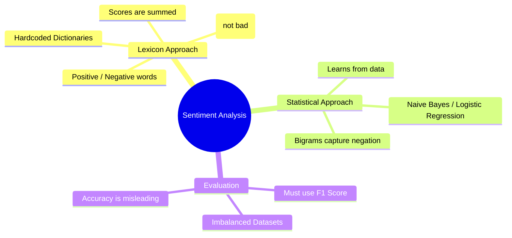

# 26. Sentiment Analysis

## 1. Topic Overview
This module applies the exact statistical text classification techniques mathematically proven in Module 25 specifically to the lucrative task of **Sentiment Analysis** (Opinion Mining). It explores how we can classify the emotional polarity of text using either hardcoded rules (Lexicons) or statistical machine learning (Naive Bayes).

## 2. Learning Path
1. [Sentiment Analysis](sentiment-analysis.md)

## 3. Real-World Applications
- **Brand Monitoring**: Sentiment Analysis is one of the most commercially valuable NLP tasks on the planet. Massive companies automatically scrape Twitter (X) and Reddit, running Sentiment Analysis over millions of posts to instantly track public opinion after a new product launch.
- **Support Escalation**: Algorithms instantly flag highly negative, angry customer support emails and automatically route them to the top of the queue for immediate human intervention.

## 4. Difficulty & Importance
- **Mathematical Difficulty**: ★☆☆☆☆ (Very Low - The lexicon approach requires only basic addition/subtraction).
- **Implementation Difficulty**: ★☆☆☆☆ (Very Low - The lexicon loop is just a few lines of basic Python dictionary lookups).
- **Exam Importance**: **Medium**. This topic is almost always tested structurally as an application of Naive Bayes and Evaluation Metrics, rather than a standalone mathematical topic.

## 5. Prerequisites
- [25. Text Classification](../25-text-classification/README.md) (Crucial: How Naive Bayes and F1-Scores work).

## 6. External Resources
- 📘 **Textbook**: *Speech and Language Processing* (Jurafsky & Martin), Chapter 4.

---

### Can You Explain This?
- [ ] I can explicitly define what a "Lexicon" is in the context of NLP.
- [ ] I can explain the structural linguistic reason why simple Lexicons fail catastrophically on the phrase "not terrible".
- [ ] I can explain mathematically how Bigram Naive Bayes solves the negation problem.
- [ ] I can explain mathematically why Accuracy is a terrible metric for Amazon product reviews.
