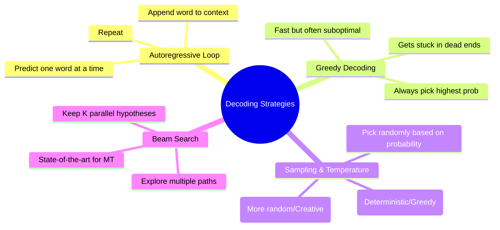

# 27. Sequence Generation

## 1. Topic Overview
This module transitions from calculating probabilities to actually generating language. It explains how a trained Language Model algorithmically hallucinates text, covering the autoregressive loop and the mathematical **Decoding Strategies** (Greedy, Sampling, Beam Search) used to pick the next word.

## 2. Learning Path
1. [Sequence Generation and Decoding Strategies](decoding-strategies.md)

## 3. Real-World Applications
- **ChatGPT & LLaMA Settings**: When you adjust the "Temperature" slider in OpenAI's API or a local LLM, you are directly physically altering the mathematical decoding strategy. Low temperature is used for strict coding tasks (where you want the deterministic "best" answer), while high temperature is used for creative writing.
- **Google Translate**: Almost all commercial Machine Translation systems utilize **Beam Search** under the hood. Translating a sentence perfectly requires looking ahead; picking the immediate best word (Greedy) often leads to grammatical dead-ends later in the sentence.

## 4. Difficulty & Importance
- **Mathematical Difficulty**: ★★☆☆☆ (Low - The math is primarily just summing log probabilities, though tracking the Beams conceptually can be slightly confusing).
- **Implementation Difficulty**: ★★★☆☆ (Medium - Writing a bug-free, efficient Beam Search algorithm with proper pruning is a classic, difficult whiteboard coding interview question).
- **Exam Importance**: **Medium-High**. Tracing a Beam Search tree on paper given a set of probabilities is a highly common, visual exam question.

## 5. Prerequisites
- [14. N-gram Language Models](../14-n-gram-language-models/README.md) (Crucial: How models generate probabilities for the next word).

## 6. External Resources
- 📘 **Textbook**: *Speech and Language Processing* (Jurafsky & Martin), Chapter 10 (Machine Translation decoding sections).

---

### Can You Explain This?
- [ ] I can explicitly define what "Autoregressive Generation" means.
- [ ] I can mathematically explain why Greedy Decoding is not guaranteed to find the sentence with the highest total probability.
- [ ] I can conceptually explain the difference between Temperature $T=0.1$ and Temperature $T=2.0$.
- [ ] I can explain what the hyperparameter $K$ (Beam Width) controls in Beam Search.
