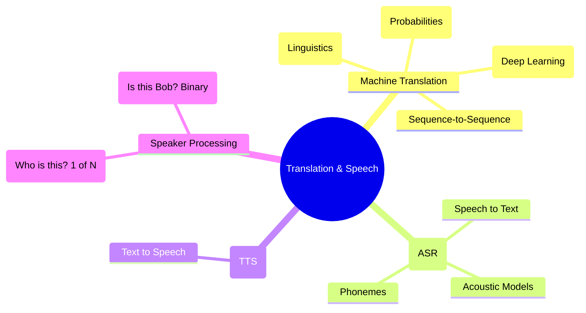

# 28. Machine Translation & Speech

## 1. Topic Overview
This module provides a high-level conceptual overview of two of the most complex, hardware-intensive fields in NLP: **Machine Translation (MT)** and **Speech Processing**. It outlines how modern algorithms mathematically convert one linguistic structure to another, or convert physical acoustic sound waves into digital text.

## 2. Learning Path
1. [Machine Translation](machine-translation.md)
2. [Speech Processing](speech-processing.md)

## 3. Real-World Applications
- **Google Translate**: Modern MT systems allow users to point their phone cameras at physical street signs in Tokyo and instantly see the English translation overlaid on the screen in augmented reality, completely breaking down global communication barriers.
- **Voice Assistants & Biometrics**: Siri and Alexa rely fundamentally on ASR (Automatic Speech Recognition) to understand your requests. Modern banks use Speaker Verification ("My voice is my password") to biometrically authenticate users over the phone.

## 4. Difficulty & Importance
- **Mathematical Difficulty**: ★☆☆☆☆ (Very Low - This module is purely conceptual and historical).
- **Implementation Difficulty**: ★☆☆☆☆ (Very Low).
- **Exam Importance**: **Medium-Low**. Usually only tested conceptually via multiple-choice or short-answer theory questions.

## 5. Prerequisites
- [14. N-gram Language Models](../14-n-gram-language-models/README.md) (Crucial: How models guarantee grammatical fluency).
- [27. Sequence Generation](../27-sequence-generation/README.md) (Crucial: How Beam Search decodes translations).

## 6. External Resources
- 📘 **Textbook**: *Speech and Language Processing* (Jurafsky & Martin), Chapters 10 and 16.

---

### Can You Explain This?
- [ ] I can explicitly describe the historical shift from Rule-Based MT to Statistical MT to Neural MT.
- [ ] I can conceptually define what a "Sequence-to-Sequence" model is.
- [ ] I can explicitly define the difference between ASR and TTS.
- [ ] I can explicitly define the difference between Speaker Identification and Speaker Verification.
- [ ] I can define the linguistic term "Phoneme".
