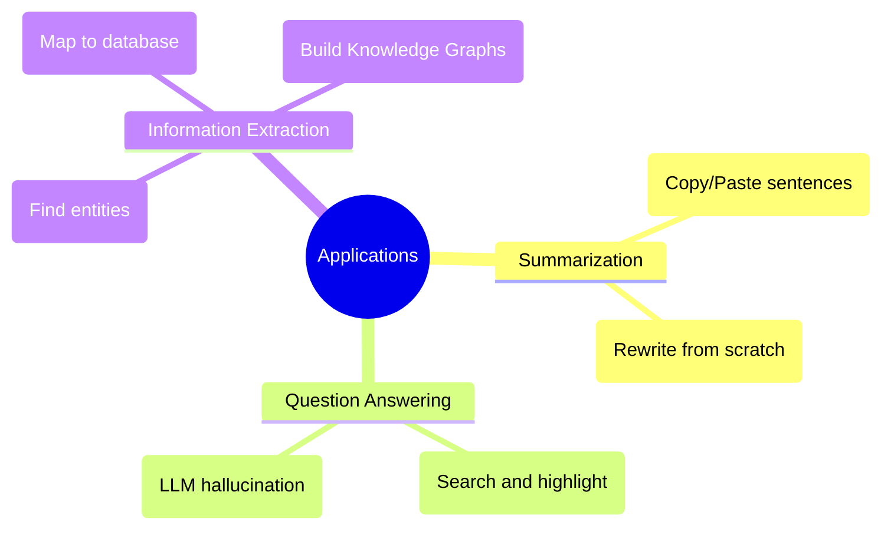

# 29. Summarization, QA & Information Extraction

## 1. Topic Overview
This module provides a high-level overview of three massive real-world NLP applications: **Summarization** (algorithmically shortening text), **Question Answering (QA)** (finding exact facts within text), and **Information Extraction** (converting unstructured text into structured relational databases).

## 2. Learning Path
1. [Summarization](summarization.md)
2. [QA and Information Extraction](qa-and-information-extraction.md)

## 3. Real-World Applications
- **Google Search**: When you type a question into Google and it highlights the exact answer in a box at the top of the screen, you are looking at a **Retrieval-Based QA** system.
- **Enterprise Knowledge Graphs**: Hedge funds and medical research companies use **Information Extraction** pipelines to automatically read millions of unstructured news articles and clinical trial papers, extracting the entities (Companies, Drugs) and their relations (e.g., `<Apple, ACQUIRED, Beats>`) to build massive, structured, searchable graph databases.

## 4. Difficulty & Importance
- **Mathematical Difficulty**: ★☆☆☆☆ (Very Low - Basic averaging for Extractive sentence scores).
- **Implementation Difficulty**: ★★☆☆☆ (Low - The classic Extractive Summarization script using TF-IDF is highly intuitive and easy to write from scratch).
- **Exam Importance**: **Medium**. These topics are usually tested via conceptual multiple-choice questions or short-answer definitions.

## 5. Prerequisites
- [09. Named Entity Recognition](../09-named-entity-recognition/README.md) (Crucial: How to identify proper nouns).
- [12. TF-IDF & Vector Semantics](../12-tf-idf-and-vector-semantics/README.md) (Crucial: How to score the importance of a word for extractive summarization).

## 6. External Resources
- 📘 **Textbook**: *Speech and Language Processing* (Jurafsky & Martin), Chapters 17, 22, and 23.

---

### Can You Explain This?
- [ ] I can explicitly define the fundamental algorithmic difference between Extractive and Abstractive summarization.
- [ ] I can explicitly define the difference between Retrieval-based QA and Generative QA.
- [ ] I can explain the difference between classical NER (tagging) and Entity Linking.
- [ ] I can define the term "Knowledge Graph".
