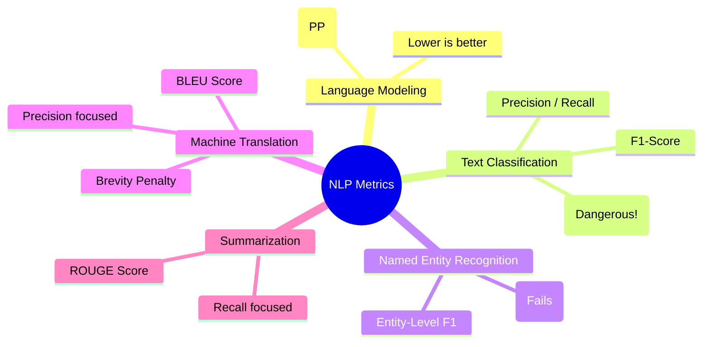

# 30. Evaluation & Metrics

## 1. Topic Overview
This module acts as a capstone review of every major mathematically rigorous evaluation metric used across the various subfields of Natural Language Processing. It explains exactly which metric is scientifically appropriate for which task, and why using the wrong metric leads to catastrophic failures in production.

## 2. Learning Path
1. [Evaluation & Metrics](evaluation-and-metrics.md)

## 3. Real-World Applications
- **Production AI Engineering**: Using the wrong metric will cause you to deploy a fundamentally broken model to production. If an engineer evaluates an Amazon review sentiment classifier using Accuracy instead of F1, or evaluates a German-to-English translator using ROUGE instead of BLEU, they will drastically overestimate the model's capabilities and cost their company millions in faulty predictions. 

## 4. Difficulty & Importance
- **Mathematical Difficulty**: ★★☆☆☆ (Low - Requires conceptual understanding of what the fractions physically measure rather than complex calculus).
- **Implementation Difficulty**: ★☆☆☆☆ (Very Low - Metric calculation libraries like `scikit-learn` or `nltk` handle the math automatically).
- **Exam Importance**: **Extremely High**. Exam questions almost universally test your ability to explicitly match a specific NLP task to its correct, rigorous evaluation metric.

## 5. Prerequisites
- [09. Named Entity Recognition](../09-named-entity-recognition/README.md) (Crucial: How BIO tags work).
- [23. Perplexity & Language Model Evaluation](../23-perplexity-and-language-model-evaluation/README.md) (Crucial: LM Metrics).
- [25. Text Classification](../25-text-classification/README.md) (Crucial: F1-Score fundamentals).
- [28. Machine Translation & Speech](../28-machine-translation-and-speech/README.md) (Crucial: Translation context).
- [29. Summarization, QA & Information Extraction](../29-summarization-qa-and-information-extraction/README.md) (Crucial: Summarization context).

## 6. External Resources
- 📘 **Textbook**: *Speech and Language Processing* (Jurafsky & Martin). (Metrics are scattered across the respective task chapters).

---

### Can You Explain This?
- [ ] I can explicitly state why Token-Level Accuracy completely fails for evaluating NER systems.
- [ ] I can explain the mathematical difference between how BLEU evaluates N-grams and how ROUGE evaluates N-grams.
- [ ] I can explicitly define what the "Brevity Penalty" is in the BLEU score and why it is mathematically necessary.
- [ ] I can perfectly map the 5 major NLP tasks (LM, Classification, NER, MT, Summarization) to their primary evaluation metrics from memory.
