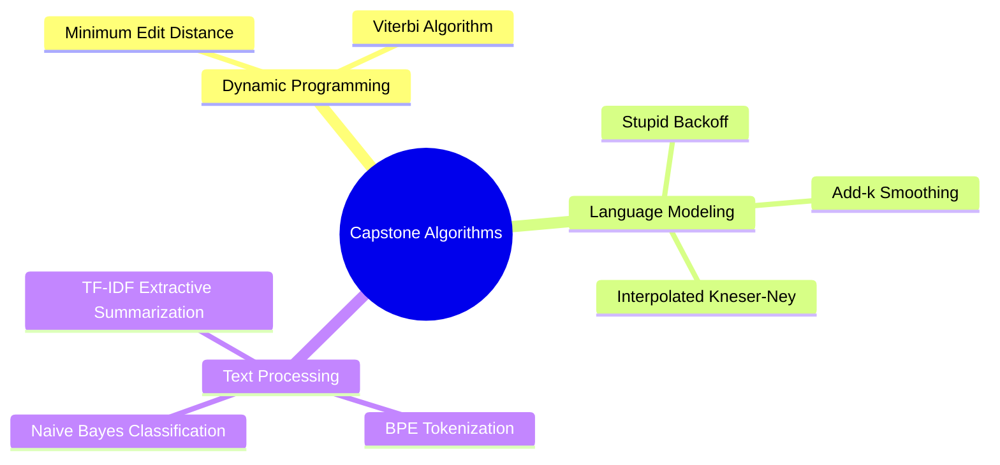

# 31. Final Scratch-Implementation Projects

## 1. Topic Overview
This is the ultimate capstone module of the entire course. It compiles the core algorithms and "from scratch" Python implementations discussed throughout the syllabus into a single, unified algorithmic reference document. 

## 2. Learning Path
1. [Scratch Implementations](scratch-implementations.md)

## 3. Real-World Applications
- **Technical Interviews**: In Silicon Valley technical interviews for NLP Machine Learning Engineer or Data Scientist roles, you will almost certainly be asked to write one of these fundamental algorithms on a whiteboard without any internet access or libraries. 
- **Production Debugging**: If you cannot translate mathematical equations into performant Python code from scratch, you cannot effectively debug a massive PyTorch or HuggingFace pipeline when it inevitably crashes in production.

## 4. Difficulty & Importance
- **Mathematical Difficulty**: ★★★★☆ (High - Translating complex recursive mathematical definitions directly into iterative code).
- **Implementation Difficulty**: ★★★★★ (Very High - This is the ultimate, uncompromising test of the course).
- **Exam Importance**: **Extremely High**. If you can successfully code these algorithms from memory, you are virtually guaranteed to pass any university NLP exam.

## 5. Prerequisites
- **All Prior Modules**. You must deeply understand the mathematical theory behind an algorithm before you can attempt to write it from scratch.

## 6. External Resources
- 📘 **Textbook**: *Speech and Language Processing* (Jurafsky & Martin).

---

### Can You Code This?
- [ ] I can successfully code the Viterbi Algorithm from memory using a dynamic programming matrix.
- [ ] I can successfully code the Minimum Edit Distance (Levenshtein) algorithm from memory.
- [ ] I can successfully code a basic BPE (Byte-Pair Encoding) Tokenizer from memory.
- [ ] I can successfully code Interpolated Kneser-Ney from memory.
