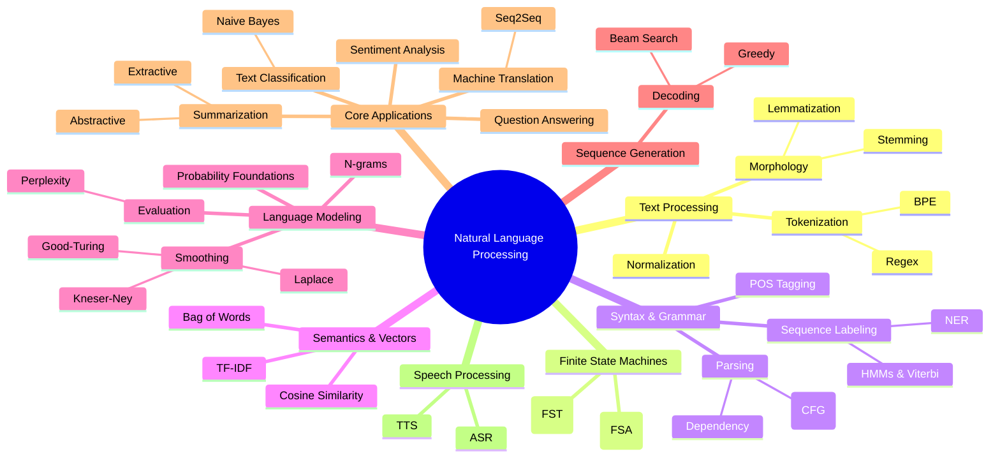

# The Global NLP Map

This map provides a visual overview of the entire Natural Language Processing syllabus. Use it to understand how the 31 individual modules connect to form the complete NLP ecosystem.

